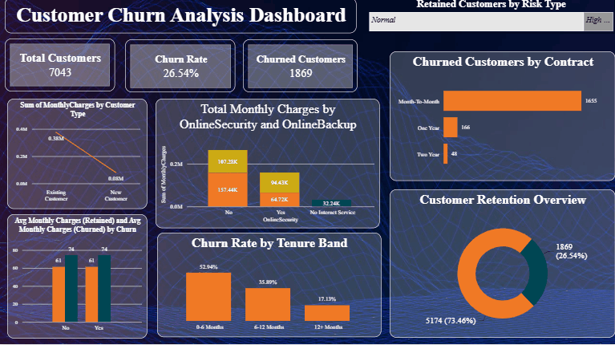

# Customer Churn Analysis Dashboard

An interactive Power BI dashboard analyzing customer churn patterns for a telecom dataset, identifying key drivers behind customer attrition to support retention strategy.

## 📊 Dashboard Preview

## 🔍 Key Insights

- **Overall churn rate:** 26.54% (1,869 out of 7,043 customers)
- **Contract type is the biggest churn driver** — month-to-month customers churn far more than one/two-year contract customers
- **Tenure matters:** Customers in their first 0–6 months show the highest churn rate (52.94%), dropping sharply after 12+ months (17.13%)
- **Add-on services** like Online Security and Backup show a strong correlation with retention

## 🛠️ Tools & Techniques

- **Power BI** — data modeling, DAX measures, Power Query transformations
- **DAX** — calculated measures for churn rate, retained/churned customer counts, average monthly charges by segment
- **Power Query** — data cleaning and shaping (telco_churn dataset)
- Visuals: KPI cards, donut chart, bar charts, contract/tenure segmentation

## 📁 Files

- `Customer_Churn.pbix` — full Power BI report file (open in Power BI Desktop)

## 📝 Notes

This project involved cleaning a raw telco customer dataset, building calculated DAX measures from scratch, and designing a KPI-focused dashboard layout for quick executive-level insight into churn behavior.

## 👤 Author

**Pratyush Kumar Singh**
[LinkedIn](https://linkedin.com/in/pratyush-singh-ds/) · [GitHub](https://github.com/pratyush460-cell)
